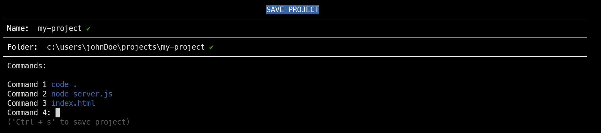

# projector

## Table of Content

- [projector](#projector)
  - [Table of Content](#table-of-content)
  - [Purpose](#purpose)
  - [Install](#install)
  - [Design](#design)
  - [Documentation](#documentation)
    - [Save a Project](#save-a-project)
      - [Interface](#interface)
      - [Use a `.psup` File](#use-a-psup-file)
    - [Load a Project](#load-a-project)
    - [Default Folder](#default-folder)
    - [List All Projects](#list-all-projects)
    - [Delete a Project](#delete-a-project)
  - [Known Bugs](#known-bugs)


## Purpose

Working on multiple projects at once? Tired of juggling windows or resetting workspaces just to check something? **Projector** makes it simple, just:

1. Save the project setup
2. Load it whenever you want with a single command

Projector runs for you all the commands required to set your projects up and running.

## Install

```bash
npm install --global projector
```

## Design

Each project record has three fields:

- **Name** -  used by `projector` as project identifier
- **Folder** - usually the project root folder (_all setup commands run here!_)
- **Commands** - list of commands to execute in the folder

## Documentation

### Save a Project

You can save a project setup in two ways:

#### Interface

Run:

```bash
projector save
```

This launches an interactive process that guides you step by step:



> LIMITATION: The interface only allows saving one project at a time.

#### Use a `.psup` File

A `.psup` file (**P**roject **S**et**up**) lets you save multiple project setups with just one command:

```bash
projector save --source project-setups.psup
```

`.psup` files require a specific structure (similar to `.yaml`) with the following fields:

- `PROJECT` - marks the start of a project setup definition
- `NAME` - project name
- `FOLDER` - root folder of the project
- `COMMANDS` - list of commands to run to setup the project

Single setup example:

```text
PROJECT:
  NAME: my-project
  FOLDER: c:\users\johnDoe\projects\my-project
  COMMANDS:
    code .
    node server.js
    index.html
```

Multiple setup examples:

```text
PROJECT:
  NAME: my-calculator-project
  FOLDER: c:\users\johnDoe\projects\my-calculator-project
  COMMANDS:
    code .

PROJECT:
  NAME: my-website
  FOLDER: c:\users\johnDoe\projects\my-website
  COMMANDS:
    code .
    node server.js
    index.html
```

### Load a Project

After you have [saved your project](#save-a-project) you can load its environment with a single command.

Run:

```bash
projector load [project-name]
```

This will run all the [commands](#design) to set up the project.

**NOTE**: If you want to run setup commands in a particular shell, use the `--shell` flag. For example:

```bash
projector load [projec-name] --shell powershell.exe
```

### Default Folder

If you prefer using the projector [interface](#interface) to save a project, you might want to define a **Default Folder**. In this way the `Folder:` field is automatically populated by the default folder while saving the project via the interface.

To define a default folder run:

```bash
projector setdf [default-folder-path]
```

If you want to see the current default folder value, run:

```bash
projector getdf
```

To _unset_ the default folder run:

```bash
projector setdf ""
```

### List All Projects

To check which projects have already been [saved](#save-a-project), run:

```bash
projector list
```

This will output a list of all available projects (next to the project name there is also its root folder):


When a project directory color is _gray_, it means that that project folder doesn't exist anymore. If there are multiple "orphan" projects you can delete them all at once just by running:

```bash
projector purge
```

Or just delete one by one with the [`delete`](#delete-a-project) command.

If you want more details about all the projects, use the `--full` flag:

```bash
projector list --full
```

### Delete a Project

If you want to delete a project, run:

```bash
projector delete [project-name]
```

## Known Bugs

- `cd` can't be used as command (this is why I opted to associate a folder to each project).
- Default folder paths can be sometimes recognized as valid even if they are not (e.g. when path has white spaces in it). It must be something related with the implementation of `fs.existsSync()` function.
