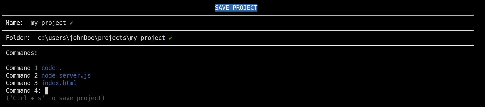

# projector

## Purpose

Working on multiple projects at once? Tired of juggling windows or resetting workspaces just to check something? **Projector** makes it simple, just:

1. Save the project setup
2. Load it whenever you want with a single command

> Projector takes care of all the commands required to set your projects up and running for development.

## Install

```bash
npm install --global projector
```

## Design

Each project setup has three fields:

- **Name** -  used by `projector` as project identifier
- **Folder** - usually the project root folder; all setup commands run here
- **Commands** - list of commands to execute in the folder 

## Documentation

### Save a Project

You can save a project setup in two ways:

#### Interface

Run:

```bash
projector save
```

This launches an interactive process that guides you step by step:



> LIMITATION: The interface only allows saving one project at a time.

#### Use a `.psup` File

A `.psup` file (**P**roject **S**et**up**) lets you save multiple project setups with just one command:

```bash
projector save --source project-setups.psup
```

`.psup` files require a specific structure (similar to `.yaml`) with the following fields:

- `PROJECT` - marks the start of a project setup definition 
- `NAME` - project name
- `FOLDER` - root folder of the project 
- `COMMANDS` - list of commands to run to setup the project

Single setup example:

```text
PROJECT:
  NAME: my-project
  FOLDER: c:\users\johnDoe\projects\my-project
  COMMANDS:
    code .
    node server.js
    index.html
```

Multiple setup examples:

```text
PROJECT:
  NAME: my-calculator-project
  FOLDER: c:\users\johnDoe\projects\my-calculator-project
  COMMANDS:
    code .

PROJECT:
  NAME: my-website
  FOLDER: c:\users\johnDoe\projects\my-website
  COMMANDS:
    code .
    node server.js
    index.html
```

### Load a Project

After you have [saved your project](#save-a-project) you can load its environment with a single command.

Run:

```bash
projector load [project-name]
```

This will run all the [commands](#design) to set up the project.

### Default Folder

If you prefer using the projector [interface](#interface) to save a project, you might want to define a **Default Folder** where all your projects live.

To define a default folder run:

```bash
projector setdf [default-folder-path]
```

After that, the `Folder:` field in the interface will be automatically populated with the default folder.

If you want to see the current default folder value, run:

```bash
projector getdf
```

In order to unset the default folder run:

```bash
projector setdf ""
```

### List All Projects

To check which projects have already been [save](#save-a-project), run:

```bash
projector list
```

This will output a list of all available projects:

## Known Bugs

- `cd` can't be used.
- Use `''` for commands
- Default folder paths can be sometimes recognized as valid even if they are not (e.g. when path has white spaces in it). It must be something related with the implementation of `fs.existsSync()` function.
